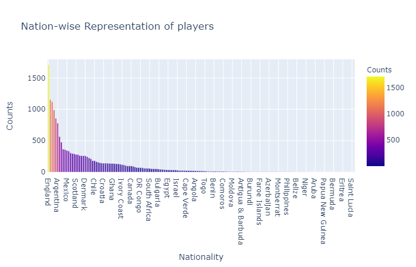
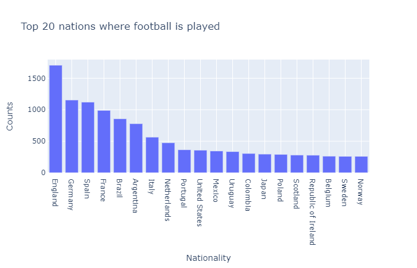
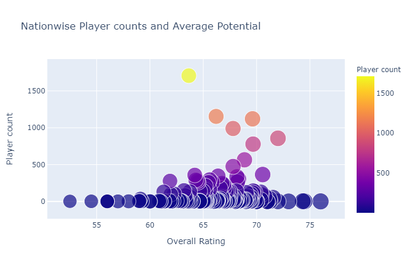
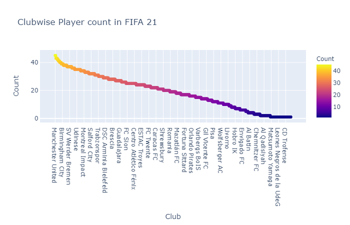
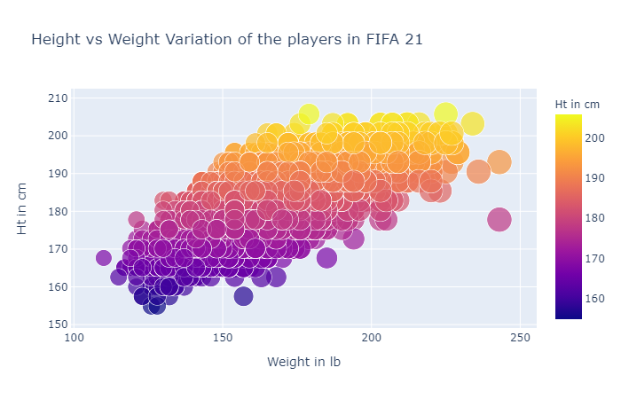
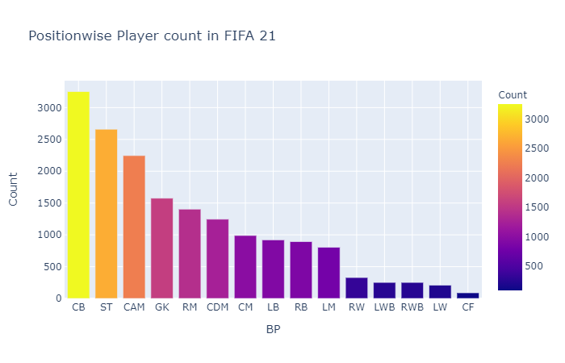
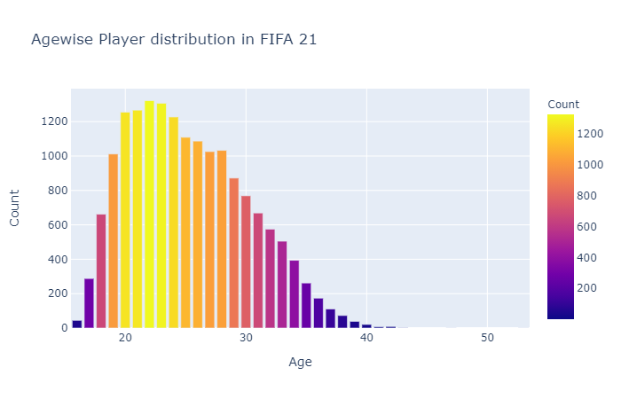

# Fifa-21 overview
* Note: You can view the outputs  here, since they are not visible in the [ipyng](https://github.com/herkura/Fifa-21-Eda/blob/main/fifa_21_eda.ipynb) file.
 # Introduction

FIFA is a series of association football simulation video games developed and released annually by Electronic Arts under the EA Sports label. Football video games such as Sensible Soccer, Kick Off and Match Day had been developed since the late 1980s and already competitive in the games market when EA Sports announced a football game as the next addition to their EA Sports label. The Guardian called the series "the slickest, most polished and by far the most popular football game around".

When the series began in late 1993, it was notable for being the first to have an official licence from FIFA, the world governing body of football. The latest installments in the series contain many exclusively licensed leagues including leagues and teams from around the world, including the German Bundesliga and 2. Bundesliga, English Premier League and EFL Championship, Italian Serie A and Serie B, Spanish La Liga and La Liga 2, French Ligue 1 and Ligue 2, Portuguese Primeira Liga, Turkish Süper Lig, Dutch Eredivisie, Scottish Premiership, the Swiss Super League, Russian Premier League, Polish Ekstraklasa, Mexican Liga MX, American Major League Soccer, South Korean K-League, Japanese J1 League, the Chinese Super League, Saudi Professional League, Australian A-League, Chilean Primera División, Brazilian Campeonato Brasileiro Série A and Argentine Superliga Argentina, allowing the use of real leagues, clubs and player names and likenesses within the games. Popular clubs from around the world, including some teams from Greece, Ukraine and South Africa, are also included, without those nations' entire leagues. The main series has been complemented by additional installments based on single major tournaments, such as the FIFA World Cup, UEFA Champions League, UEFA Europa League and UEFA European Football Championship, as well as a series of football management titles.

As of FIFA 21, Paris Saint-Germain forward Kylian Mbappé is the face of the franchise, appearing on the front cover of the series and in promotional campaigns and advertisements. He takes over from Eden Hazard of Real Madrid who was the face of the previous cover. Lionel Messi appeared on four straight covers from FIFA 13 to FIFA 16. Wayne Rooney has appeared in the most covers being on the cover of every game from FIFA 06 to FIFA 12. Since the release of FIFA Mobile in 2016, forward Marco Reus, Eden Hazard, Cristiano Ronaldo, Neymar, and Paulo Dybala have appeared on the cover

# Importing the libraries
* `import pandas as pd`
* `import seaborn as sns`
* `import matplotlib.pyplot as plt`
* `import plotly.express as px`

# Nation wise representation of players

# Top 20 nations where footbal is played

# Which nation has the most number of over performing players?

# Total number of players team-wise

# height vs weight variation in football players.

# Counting the players posotion wise 

# Age distribution of the players
 
